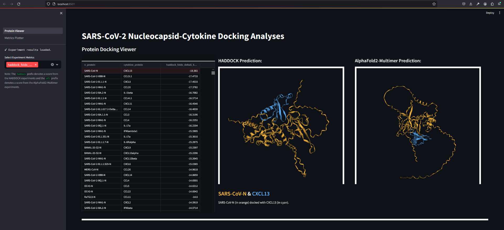

# Human Cytokine and Coronavirus Nucleocapsid Protein Interactivity Using Large-Scale Virtual Screens

<h3 align="right">Phillip J. Tomezsko, Colby T. Ford, Avery E. Meyer, Adam M. Michaleas, Rafael Jaimes III<br>MIT Lincoln Lab and Tuple</h4>

Large scale, _in silico_ interaction analyses of SARS-CoV-2 nucleocapsid protein variants against human cytokines.

<!--Preprint: https://www.biorxiv.org/content/10.1101/2023.11.28.569056 -->

[](https://www.frontiersin.org/articles/10.3389/fbinf.2024.1397968/full)


## About This Repository
In this repository, you'll find both the HADDOCK and AlphaFold2-Multimer results presented in the above paper. Plus, we have included the logic for preparing the various experiments and submitting them to an high-performance computing (HPC) environment.

- Full Results CSV: [full_experiment_results.csv](full_experiment_results.csv)
- GIRAF Code: [giraf/](giraf/)


### HADDOCK 2.4 Analyses

HADDOCK 2.4 was run to dock 1,088 combinations of 64 human cytokines × 17 N proteins. We refer to these combinations as "experiments".

Ambiguous Interaction Restraints (AIRs) were defined using a random selection of 20% of the surface residues on the input proteins. This was to reduce our input bias surrounding the docking site while reducing computation time.

HADDOCK generates 200 PDB complexes for each experiment in each of its three iterations:
1. Rigid body docking ($it_0$)
2. Semi-flexible refinement ($it_1$)
3. Solvent refinement in water ($it_w$)

In the final water refinement step, the HADDOCK system will cluster the complexes and generate cluster-level metrics.

From these cluster-level metrics, we select the best cluster based on the lowest _van der Waals_ energy. Then, from this best cluster, we select the best (representative) PDB file as the one with the lowest _van der Waals_ energy.


#### Results

- Experiment Results: [haddock/postprocessing/experiment_results.csv](haddock/postprocessing/experiment_results.csv)
- Best PDBs: [haddock/postprocessing/best_pdbs/](haddock/postprocessing/best_pdbs/)

#### Resources

- HADDOCK 2.4 scoring function: https://www.bonvinlab.org/software/haddock2.4/scoring/
- HADDOCK 2.4 clustering logic: https://www.bonvinlab.org/software/haddock2.4/analysis/#cluster-based-analysis
- Docker containerized version of HADDOCK, which can be found at: https://github.com/colbyford/haddocker
- High-Performance Computing submission scripts for both SBATCH and LLMapReduce: [haddock/submission](haddock/submission).


### AlphaFold2 Multimer Analyses

AlphaFold2-Multimer was also run to dock the same 1,088 "experiments" (combinations of 64 human cytokines × 17 N proteins).

#### Results

- Experiment Results: [alphafold2_multimer/AF23_experiment_results.csv](alphafold2_multimer/AF23_experiment_results.csv)
- Best PDBs: [alphafold2_multimer/best_pdbs](alphafold2_multimer/best_pdbs)


#### Resources
- AlphaFold2 Singularity Container: https://github.com/mit-ll/AlphaFold
- The code for AlphaFold-Mulmimer can be found here: https://github.com/google-deepmind/alphafold


### Data Explorer App

We have provided a basic data explorer that allows for the generation of figures and the viewing of the PDB complexes. This application is written in Streamlit. To run the application locally, use the following commands:

via Python (Terminal or Command Prompt):
```bash
cd vis_app/
# python -m pip install -r requirements.txt
streamlit run Protein_Viewer.py
```

via Docker:
```bash
docker build -t n_cyto_app -f vis_app/Dockerfile .
docker run -p 8501:8501 --name n_cyto_app -d n_cyto_app

## To run in an interactive shell:
# docker run --rm -it --entrypoint bash n_cyto_app
# docker exec -it n_cyto_app /bin/bash
```

Then, navigate to [`http://localhost:8501`](http://localhost:8501) in your web browser.


