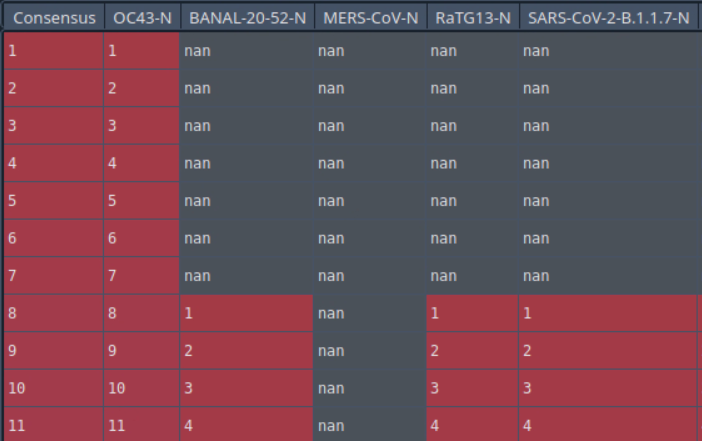

# GIRAF: Graph-based Interface Residue Assessment Function  
This algorithm constructs bipartite graph networks that capture the interfacing residues between two chains in a protein complex.  
GIRAF was designed and works out of the box for INTERCAAT [1] outputs, but could be adapted to other methods.  

Once the graphs are created, you can calculate the graph edit distance (GED) between any pair of graphs to quantify the similarity of the binding interactions.  

## Getting started  
Mamba was used to create a Python virtual env:  

```
mamba env create -n giraf  
mamba activate giraf  
mamba install networkx pandas matplotlib
```  

The following versions of packages were used:  
* Python 3.11  
* NetworkX 3.1  
* Pandas 2.0.3  
* Matplotlib 3.7.1  (to recreate the figures of the manuscript)

By default, if you just run the script as-is, it will perform the analysis and display the figures shown in the manuscript.  

## Running Your Own Analysis

### 1. Building the Lookup Table (LUT)  (Optional)
Developing a notion of a consensus sequence is optional, but recommended. For this project, we used *Geneious* [2], but you could use other MSA algorithms or do it manually.  
Here's an example:  

OC43 is longer than the other coronaviruses so it sets the stage at the beginning. Residue #8 is equivalent to Residue #1 for BANAL-20-52 and SARS-CoV-2, and so on.  
Where the residue is missing, there is a "nan". The N proteins are much longer than this, but this just shows the beginning of the alignment.  

  

The table shown will be saved as a LUT automatically and will be used in the following way:  
If GIRAF sees an interaction on BANAL-20-52 on residue #4 it will know to renumber it as residue #11 (consensus), and so on.  
So all the numbering will be consistent with the consensus sequence, that way apples will be compared to apples.  

### 2. Setting Parameters  
There are 3 parameters you can change:  

**`TIMEOUT`** - default value 4  (in seconds), this can be lengthened to give more time for the graph edit distance (GED) algorithm to minimize.  
Depending on the complexity of the graphs, it may never converge to an absolute minimum, so it suggested to always have a value set here.  

**`DIST_CUTOFF`** - default value 3 (in angstroms), adjust the distance of the atom-level interactions you want to consider.  
**NOTE: regardless of your choice of variables to construct the graphs, the `DIST_CUTOFF` will always be active.**

**`VARIABLES`** - This adjusts how complex you want to build your graphs, in increasing complexity:  
* `res_nums` (recommended) - make the graphs based on the residue number only, do not consider the atom or amino acids (trust your MSA). 
* `no_atms` - based on the amino acid and its number, not the atom. Good if you don't have an MSA and you don't want to evaluate blindly.
* `all` - based on the all interaction parameters. This will make a very busy graph and should only be used for short interacting chains.  
                 It considers the atoms and the distance between them.

### 3. Data Inputs  
At minimum, GIRAF needs two INTERCAAT output files to compare.  
It's recommended to have a subdirectory for each analysis and place the appropriate INTERCAAT files there that need to be compared.  
The reference interface needs to be specified as `file1`   
e.g.:  
`file1 = 'SARS-CoV-2-WA1-N_CXCL12beta_relaxed_model_2_multimer_v3_pred_2.pdb_intercaat.txt'`  

All other files do not need to be specified, just place them in the subdirectory and set your analysis directory name:  
e.g.:  
`analysis_dir = 'CXCL12beta_analysis/AF2_INTERCAAT/'`  

### 4. Results  
As mentioned previously, by default the main script will output figures for the manuscript.  
For your own analysis you'll need to adjust the setup of the figures. 
If you just want the Graph Edit Distance (GED) for your two graphs, you just need to run this line after the graphs are created:  

`ged = nx.graph_edit_distance(graph1, graph2, timeout=TIMEOUT, node_subst_cost=node_subst_cost)`  

Of course, you can run a FOR loop and run many GEDs, create bar plots comparing them.   
You can use the provided examples as a starting point.  

## References
[1] INTERCAAT: Interface Contact definition with Adaptable Atom Types software  
code: https://gitlab.com/fiserlab.org/intercaat  
publication: https://academic.oup.com/bioinformatics/article/38/2/554/6367763  

[2] Geneious https://www.geneious.com  

## Legal  
DISTRIBUTION STATEMENT A. Approved for public release. Distribution is unlimited.  
This material is based upon work supported by the Department of the Air Force under Air Force Contract No. FA8702-15-D-0001. 
Any opinions, findings, conclusions or recommendations expressed in this material are those of the author(s) 
and do not necessarily reflect the views of the Department of the Air Force.

© 2023 Massachusetts Institute of Technology.

The software/firmware is provided to you on an As-Is basis

Delivered to the U.S. Government with Unlimited Rights, as defined in DFARS Part 252.227-7013 or 7014 (Feb 2014). 
Notwithstanding any copyright notice, U.S. Government rights in this work are defined by DFARS 252.227-7013 or DFARS 252.227-7014 as detailed above. 
Use of this work other than as specifically authorized by the U.S. Government may violate any copyrights that exist in this work.
